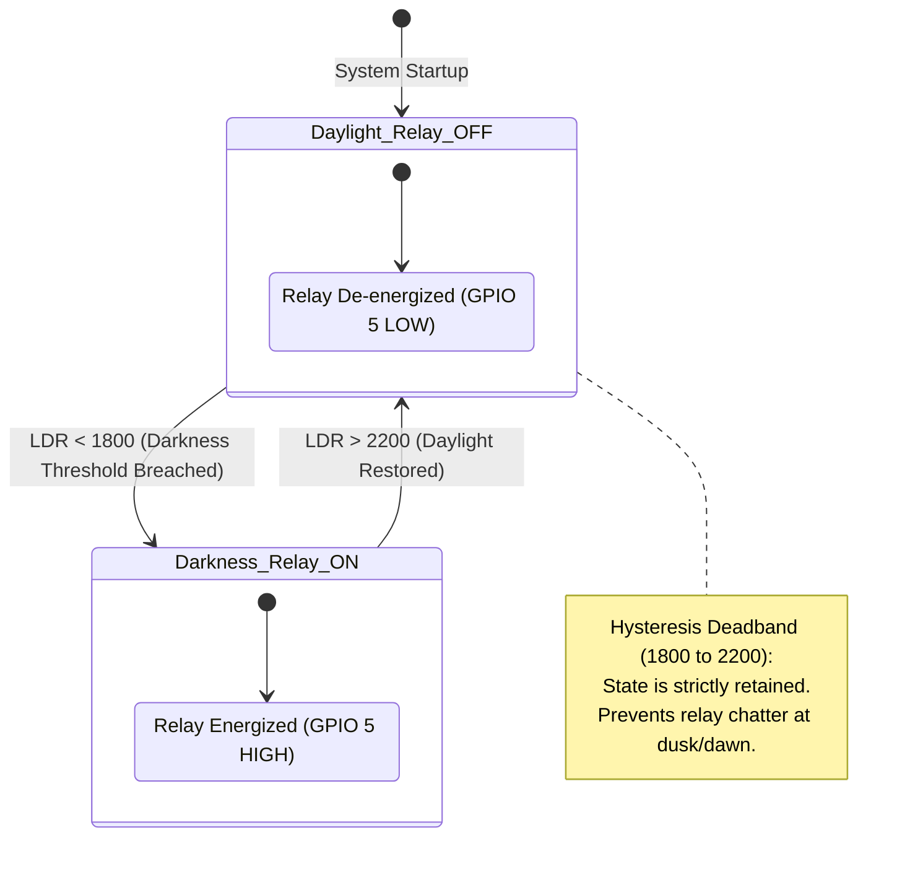

# Hysteresis State Machine: Dual-Threshold Autonomous Lighting

```mermaid
stateDiagram-v2
    [*] --> Daylight_Relay_OFF: System Startup

    state Daylight_Relay_OFF {
        [*] --> Lamp_OFF
        Lamp_OFF: Relay De-energized (GPIO 5 LOW)
    }

    state Darkness_Relay_ON {
        [*] --> Lamp_ON
        Lamp_ON: Relay Energized (GPIO 5 HIGH)
    }

    Daylight_Relay_OFF --> Darkness_Relay_ON: LDR < 1800 (Darkness Threshold Breached)
    Darkness_Relay_ON --> Daylight_Relay_OFF: LDR > 2200 (Daylight Restored)

    note right of Daylight_Relay_OFF
        Hysteresis Deadband (1800 to 2200):
        State is strictly retained.
        Prevents relay chatter at dusk/dawn.
    end note
```
